# Blockchain-Based-Property-Registration

<a href="LICENSE"></a>


## Land Registration using Blockchain
## Problem it Solves:
1. The elimination of middlemen: The elimination of middlemen or brokers makes the process of land registration less expensive. Brokers who try to defraud uninformed people will be unable to do so any longer. Brokers frequently take a long time to finish procedures, thus our project will help people save time.
3. A distributed tamper-proof ledger that prohibits ownership fraud.
4. IPFS is used to store important property registration papers in a secure manner.

## Technology Stack:
1. Ethereum Blockchain
2. Polygon/Matic
3. Web3Dart
4. IPFS
5. Flutter
6. Metamask

## Demo
Our Dapp is demonstrated in this video [here](https://youtu.be/Gih0trIDgvA)

This is for demonstration purposes only. With this key, you can log in as Land Inspector:
 <pre><b>6b86cddfedbec68ed2a1c7e14b993840a0848595ba5787aec9e8a38b18f0d96a</b></pre>
For user: <pre><b>3ed4aff1a8ff8e28df3cd307112f9166886edcc85a27136908e3b1687b111f89</b></pre>\
You can also use your own Ethereum wallet key as a user.

#### Check new Smart contract At Polygon Testnet: [here](https://mumbai.polygonscan.com/address/0xbc6d9e15255533C19f1589A7e9fbB60440a539e0)

#### Check Smart contract At (discontinued) Ropsten Ethereum Testnet: [here](https://ropsten.etherscan.io/address/0x702058ba021cd4e4f847b40f32b58aa5be3a4661)

## To Run Application Locally
1. Clone the github repository and cd to the folder
2. Install the flutter 3.0.2, nodejs
3. Install ganache and truffle as shown below:
```
npm install -g truffle
```
4. Open Ganache and keep it running in the Background
5. Install the Metamask chrome extension, choose the local network and import the accounts
6. Compile and run our migrations from the command line as shown below:
```
truffle compile
truffle migrate
```
6 .Copy contract address as seen in the image below and paste in variable `contractAddress` located in the file `./lib/constant/constant.dart`
<pre>
2_deploy_migration.js
=====================

   Replacing 'Land'
   ----------------
   > transaction hash:    0x427b2b402f767ac6a90334ab3c687b086b274de747fe10d6e194743b15057d78
   > Blocks: 0            Seconds: 0
   <b>>contract address:    0xed690C24C60A48F8A9819c9A15AD75B70CFBEa5a</b>
   > block number:        3
   > block timestamp:     1650602828
   > account:             0x33e94e4619f0AecDf81e9676Eb82c109FBa53356
   > balance:             99.9154895
   > gas used:            3996227
   > gas price:           20 gwei
   > value sent:          0 ETH
   > total cost:          0.07992454 ETH
</pre>
7. In `constant.dart` file, change the value of the variable `chainId` to `'1337'` and change the value of the variable `rpcUrl` to `"http://127.0.0.1:7545"`
8. Run the flutter web app
```
flutter pub get

flutter run -d web-server --web-port 5555
```
9. Open the browser and the dapp will be running in http://localhost:5555/
10. Create mapbox api key from https://www.mapbox.com/ and Replace it with `mapBoxApiKey`in `constant.dart` file

## Project Flowchart


## Screenshots
Home Page                   |                   Wallet connect/Login
:---------------------------------:        |      :------------------------------:
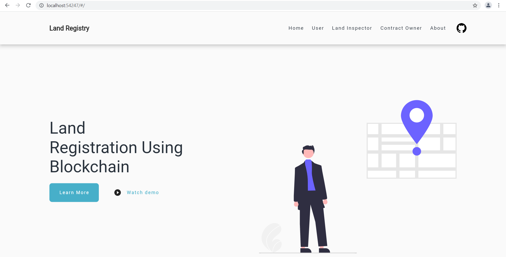  |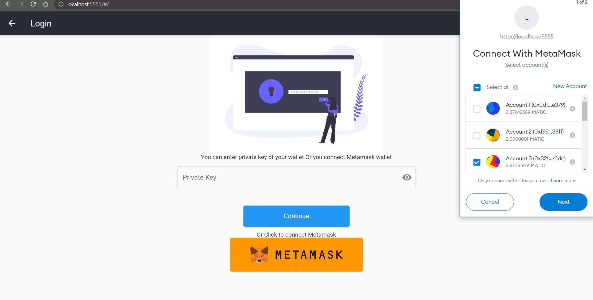

Contract Owner Dashboard               |                   User Registration
:---------------------------------:        |      :------------------------------:
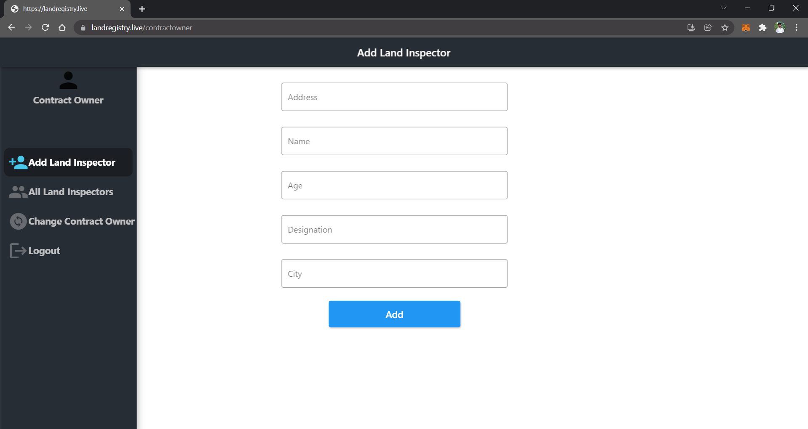  |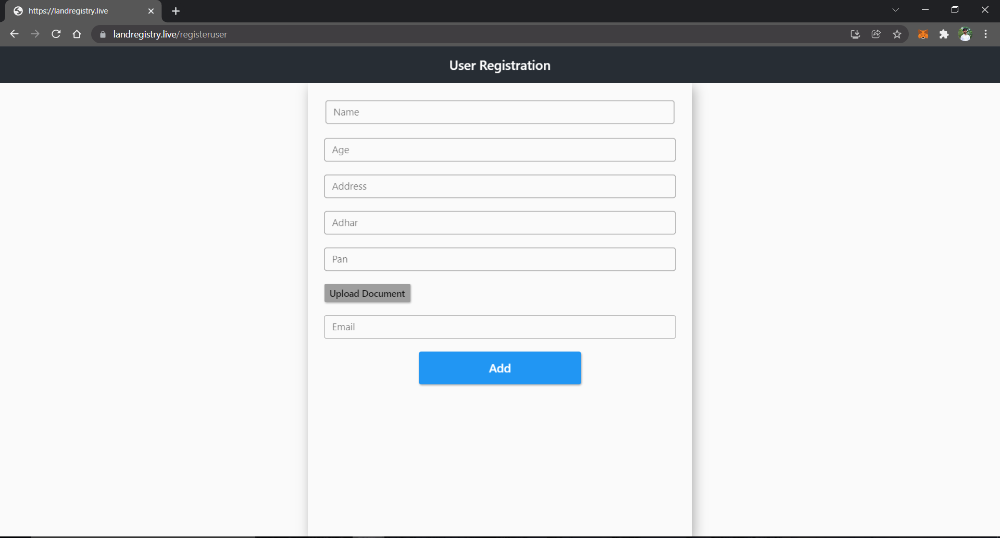

Land Inspector Dashboard                   |                  User Verification 
:---------------------------------:        |      :------------------------------:
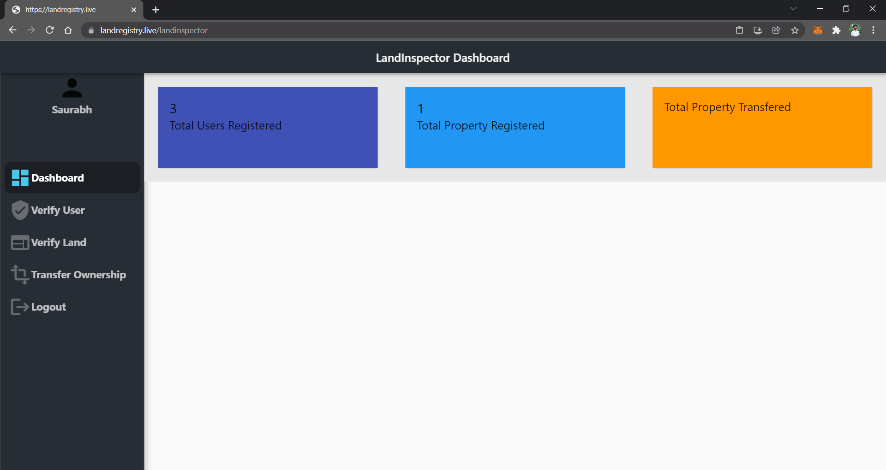     |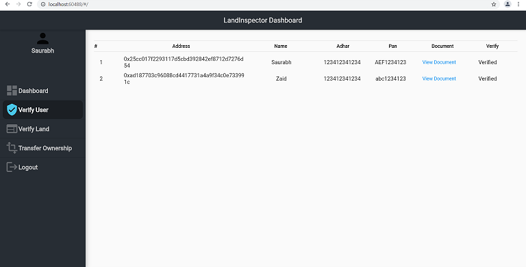

User Dashboard               |                  Adding land on Map    
:---------------------------------:        |      :------------------------------:
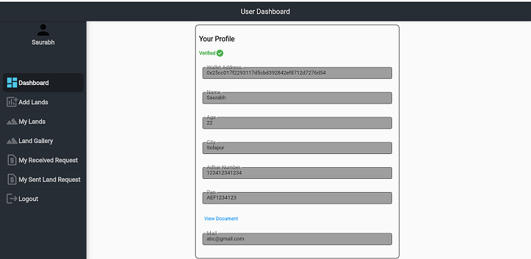     |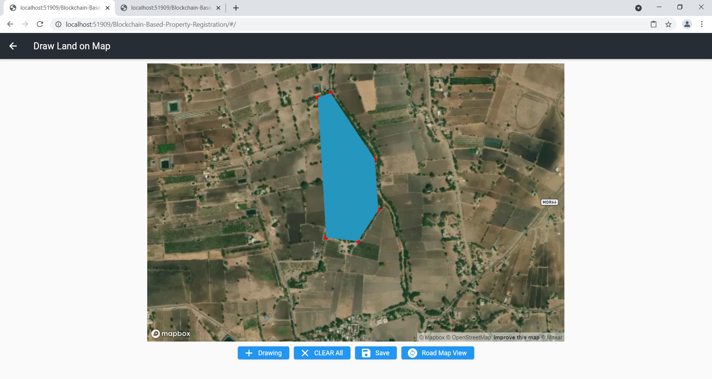

Land Gallery                |                   Land Details    
:---------------------------------:        |      :------------------------------:
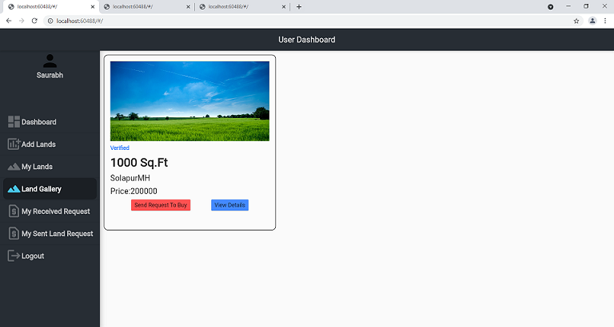     |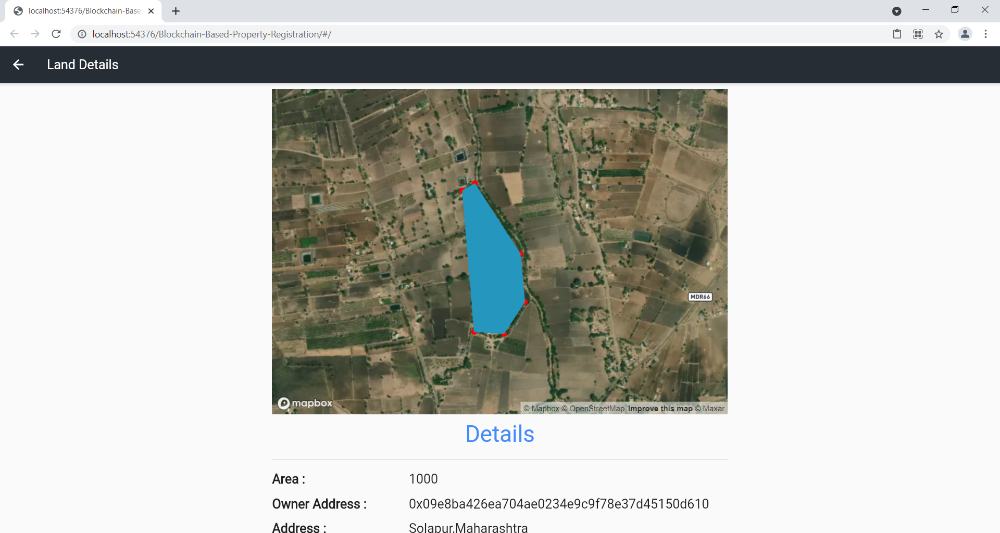

Received Request           |                   Make Payment  
:---------------------------------:        |      :------------------------------:
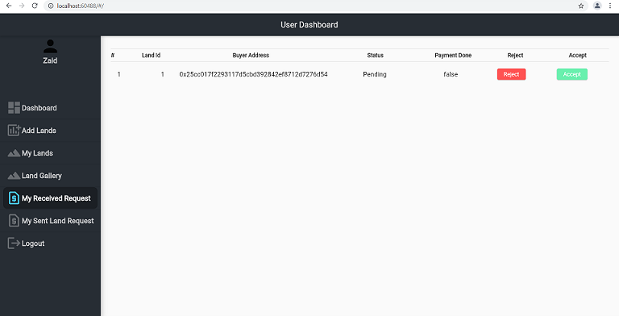     |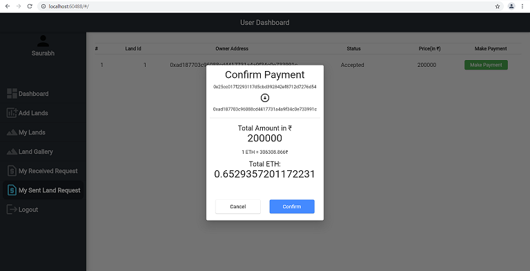

Transfer ownership,Seller,buyer photo capture   |                Witness info,photo capture,transfer ownership 
:---------------------------------:        |      :------------------------------:
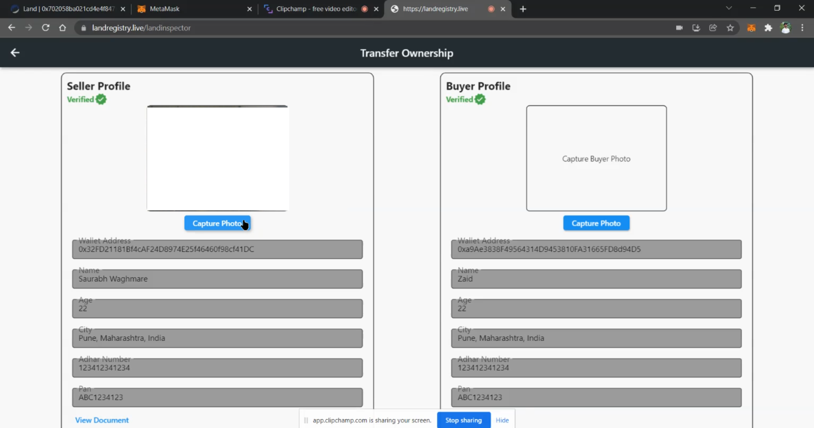     |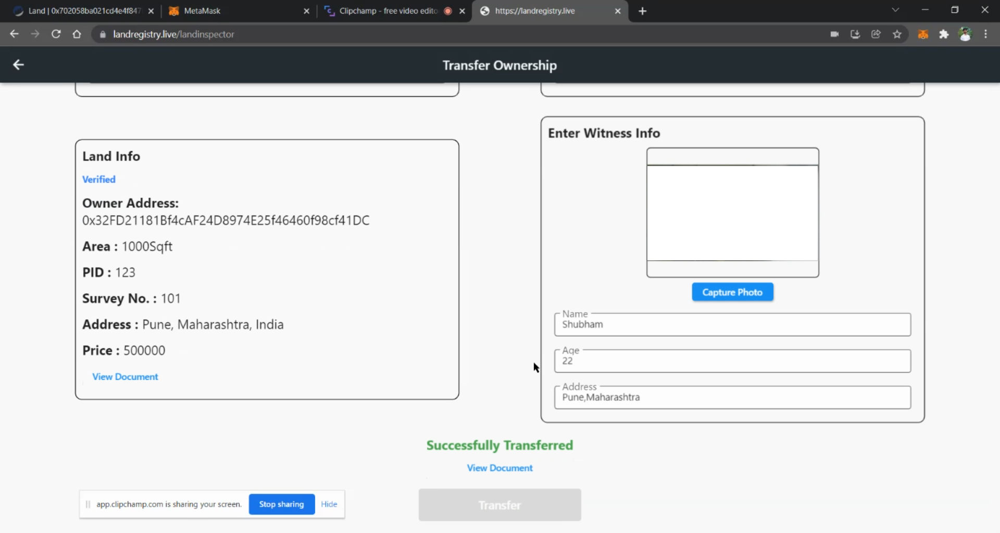

## Contract

This Solidity smart contract is designed to manage a decentralized land marketplace, where users can register, verify their identity, add land for sale, and initiate land purchase transactions. Let's break down the main components and functionalities of the contract:

### Contract Structure:

- **`Land` Contract:** The main contract is named `Land`.
- **State Variables:**
    - `contractOwner`: Address of the owner of the contract.
    - Various counters (`inspectorsCount`, `userCount`, `landsCount`, `documentId`, `requestCount`) to keep track of the number of inspectors, users, lands, documents, and requests.
- **Mappings:**
    - `InspectorMapping`, `UserMapping`, `lands`, `LandRequestMapping`: These mappings are used to store information about inspectors, users, lands, and land requests respectively.

### Structs:

- `Landreg`: Represents information about a piece of land.
- `User`: Represents information about a user.
- `LandInspector`: Represents information about a land inspector.
- `LandRequest`: Represents a request to buy a specific piece of land.

### Enums:

- `reqStatus`: Represents the possible states of a land purchase request (`requested`, `accepted`, `rejected`, `paymentdone`, `completed`).

### Functions:

### Contract Owner Management:

- `isContractOwner`: Checks if a given address is the contract owner.
- `changeContractOwner`: Allows the contract owner to change ownership to another address.

### Land Inspector Management:

- `addLandInspector`: Allows the contract owner to add a land inspector.
- `removeLandInspector`: Allows the contract owner to remove a land inspector.
- `ReturnAllLandIncpectorList`: Returns a list of all land inspectors.

### User Management:

- `registerUser`: Allows users to register by providing personal information.
- `verifyUser`: Allows land inspectors to verify a user's identity.
- `isUserVerified`: Checks if a user is verified.
- `ReturnAllUserList`: Returns a list of all registered users.

### Land Management:

- `addLand`: Allows users to add a piece of land for sale.
- `verifyLand`: Allows land inspectors to verify a piece of land.
- `isLandVerified`: Checks if a piece of land is verified.
- `makeItforSell`: Marks a piece of land as available for sale.
- `requestforBuy`: Allows users to request to buy a piece of land.
- `acceptRequest` and `rejectRequest`: Allows landowners to accept or reject a land purchase request.
- `requesteStatus`: Checks the status of a land purchase request.
- `landPrice`: Returns the price of a piece of land.
- `makePayment`: Allows buyers to make payments for accepted land purchase requests.
- `returnPaymentDoneList`: Returns a list of completed land purchase requests.
- `transferOwnership`: Allows land inspectors to transfer ownership of a verified land after successful payment and completion.

### Testing Function:

- `makePaymentTestFun`: A testing function to facilitate direct payment transfers.

Note: The code assumes a certain level of trust in the interactions, and in a real-world scenario, additional security measures and validations may be necessary.
